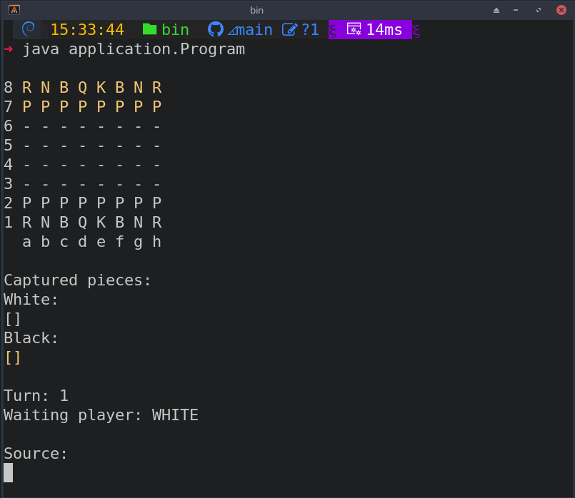

# Chess Game

Este é um projeto simples de um jogo de xadrez em Java, implementado usando orientação a objetos.

## Estrutura do Projeto

O projeto está organizado em vários pacotes:

- `chess`: Contém classes relacionadas ao jogo de xadrez em geral.
- `chess.pieces`: Contém classes específicas para diferentes tipos de peças de xadrez.
- `bordgame`: Classes relacionadas ao tabuleiro do jogo.

```bash
src
├── application
│   ├── Program.java
│   └── UI.java
├── bordgame
│   ├── BoardException.java
│   ├── Board.java
│   ├── Piece.java
│   └── Position.java
└── chess
    ├── ChessException.java
    ├── ChessMatch.java
    ├── ChessPiece.java
    ├── ChessPosition.java
    ├── Color.java
    └── pieces
        ├── Bishop.java
        ├── King.java
        ├── Knight.java
        ├── Pawn.java
        ├── Queen.java
        └── Rook.java
```
## Classes Principais

### ChessPiece

A classe `ChessPiece` é uma classe abstrata que representa peças de xadrez. Contém métodos e propriedades comuns a todas as peças.

### ChessPosition

A classe `ChessPosition` representa as posições no tabuleiro de xadrez usando notação alfanumérica (por exemplo, "a1", "h8").

### Color

Um enum `Color` para representar as cores das peças de xadrez (preto ou branco).

### Bishop, King, Knight, Pawn, Queen, Rook

Essas classes representam peças específicas do xadrez e estendem a classe `ChessPiece`. Cada uma implementa seu próprio comportamento de movimento.

## Tratamento de Erros e programação defenciva

O código implementa algumas verificações de erro e tratamentos específicos. Aqui estão alguns cenários possíveis:

	1. Coordenadas Inválidas:
	* Se o usuário ou a lógica do jogo fornecer coordenadas inválidas (fora dos limites do tabuleiro), o código lança uma exceção ChessException.
	* Certifique-se de instruir os usuários a fornecerem coordenadas válidas no formato correto (por exemplo, a1 a h8).
	
	2. Movimentos Inválidos das Peças:
	* Se um jogador tentar fazer um movimento inválido com uma peça (por exemplo, tentar mover uma peça para uma posição 					ocupada por outra peça), o código pode lançar exceções específicas para isso.
	* Instrua os usuários a seguir as regras do xadrez e a evitar movimentos inválidos.
	
	3. Operações Fora do Tabuleiro:
	* Se o código tentar acessar uma posição fora dos limites do tabuleiro, o tratamento de erro é realizado.
	* Explique aos usuários que as operações devem ocorrer dentro dos limites do tabuleiro.

## Exemplo de Uso

Aqui está um exemplo básico de como criar um jogo de xadrez:

 * Clonar o repositório [aqui](https://github.com/lasbrDev/chessgame-consoleapplication.git)
 * Acessar o diretório **bin**
 
 ```bash
 $ cd chessgame-consoleapplication
 $ cd bin
 java application.Program
```


## Stack Utilizada

- Java 17

## Conceitos abordados

Este projeto foi fundamental para a compreensão dos conceitos de orientação a objetos em Java, abrangendo todos os pilares fundamentais desse paradigma, incluindo herança, polimorfismo, encapsulamento e composição. Além disso, demonstra a aplicação de boas práticas de código e design de software.
	
## Contribuição

Sinta-se à vontade para contribuir para o projeto abrindo problemas ou enviando solicitações de pull. Toda contribuição é bem-vinda!


		
